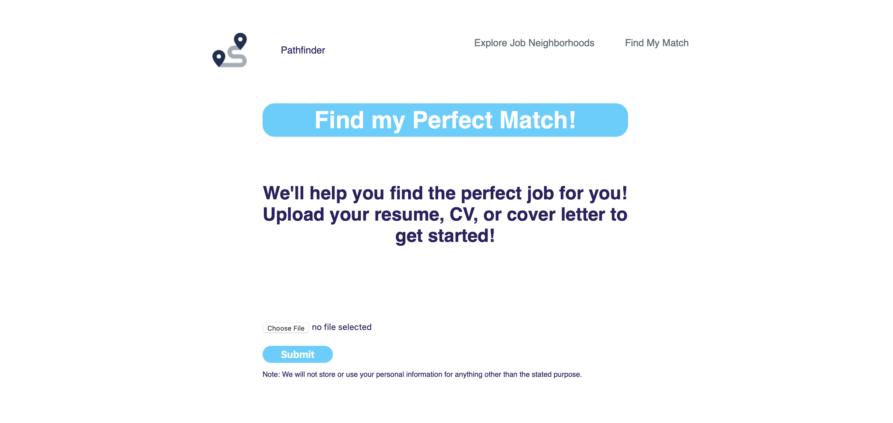
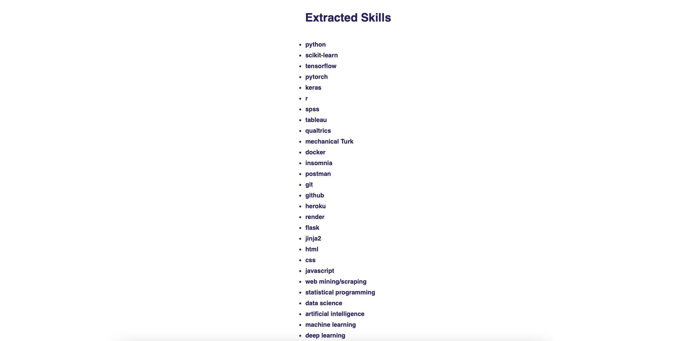

# Pathfinder
   

## Purpose: 
#### This is a FastAPI web application designed to allow job-seekers to learn more about various occupations and explore their future career path. See below for details and page descriptions. If you like the app, please star and/or fork and check back for future releases. 

## To Clone the App and Run it Locally:
#### Note:
* You must have python3.10.9 installed.

#### In a terminal run the following commands:

```
pip3 install --user virtualenv
git clone https://github.com/celise88/Pathfinder.git
cd Pathfinder
python3 -m venv .venv
source .venv/bin/activate
pip3 install -r requirements.txt
```
#### Register for an account at https://groq.com and create an api key. 
#### Create a .env file in the main repository with:

GROQ_API_KEY=<"your_api_key">

#### Then, in the terminal run:
```
uvicorn main:app
```

And navigate to http://localhost:8000/ in your browser

#### (You can also Dockerize the app using the Dockerfile and docker-compose.yaml.)

## Page Descriptions:

### Home Page:
#### Select a job title from the dropdown and click submit to get information about the selected job.


### Job Neighborhoods Page:
#### Click on the "Explore Job Neighborhoods" link to see which job neighborhood(s) your job(s) of interest occupy. 


### Job-Matcher Page:
#### Click on the "Find My Match" link to upload your resume, see your skillset, and get job recommendations. 

#### Resume Upload Functionality:


#### Example Extracted Skills Ouput:


#### *Please see the version history below for a description of the models and algorithms underlying the app functionality.  

## Version history:
 
* Initial commit - 2/3/2023 - Allows users to select a job title to learn more about and get a brief description of the selected job and the major tasks involved, which is dynamically scraped from https://onetonline.org. The job neighborhoods page was generated by using Co:here AI's LLM to embed ONET's task statements and subsequently performing dimension reduction using t-SNE to get a 2-D representation of job "clusters." The distance between jobs in the plot corresponds to how similar they are to one another - i.e., more similar jobs (according to the tasks involved in the job) will appear more closely "clustered" on the plot.

* Version 1.1.1 - 2/5/2023 - Added full functionality to the "find my match" page where users can upload a resume, curriculum vitae, cover letter, etc. to have their skills extracted from the text.  Neural text embeddings are then produced for the user's resume. Using a csv file containing the text embeddings for all ONET jobs, cosine similarity is calculated to determine how similar the user's resume is to each job description (the embedded ONET task statements) - this is the user's "match score."  
    * The classification model underlying the skills extractor is a custom distilbert-base-uncased binary classification model that was finetuned using a balanced dataset comprised of the emsi (now Lightcast) open skills database and a random sample of the dbpedia database. The model achieved an f1 score of 0.967 on the validation sample (accuracy of 0.967, loss of 0.096). It can be accessed via Hugging Face: https://huggingface.co/celise88/distilbert-base-uncased-finetuned-binary-classifier.
    * Cohere's LLM is used to get the neural text embeddings. (I plan to incorporate an open-source embedding model in a future release.)

* Version 1.1.2 (current version) - 1/29/2024 - Migrated from a finetuned Distilbert LLM and Cohere.ai's embedding model to Mistral (see https://huggingface.co/mistralai/Mistral-7B-v0.1) and sentence-t5-base (see https://huggingface.co/sentence-transformers/sentence-t5-base), respectively.