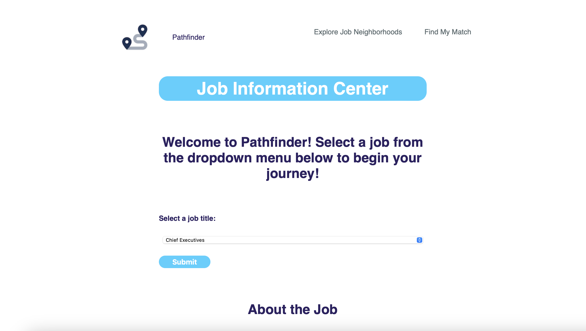
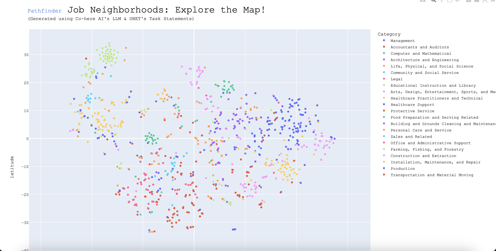

# Pathfinder
   

## Purpose: 
#### This is a web application designed to allow job-seekers to learn more about various occupations and explore their future career path. See below for details and page descriptions. If you like the app, please star and/or fork and check back frequently for future releases. 

Note: This is an in-progress FastAPI version of the "ONET-Application" Flask app in my repo.

## To Access the App:
#### Note:
* You must have python3.10.9 installed.

#### In a terminal run the following commands:

```
pip3 install --user virtualenv
git clone https://github.com/celise88/ONET-Application.git
```

```
cd Pathfinder
python3 -m venv .venv
source .venv/bin/activate
pip3 install -r requirements.txt
uvicorn main:app
```

And navigate to http://localhost:8000/ in your browser

(Advanced: You can also use the Dockerfile in the repo to build an image and run a container.)

## Page Descriptions:

### Home Page:
#### Select a job title from the dropdown and click submit to get information about the selected job.



### Job Neighborhoods Page:
#### Click on the "Explore Job Neighborhoods" link to see which job neighborhood(s) your job(s) of interest occupy. 



#### *Please see the version history below for a description of the models and algorithms underlying the app functionality. 

## Version history:
 
* Initial commit - 2/3/2023 - Allows users to select a job title to learn more about and get a brief description of the selected job and the major tasks involved, which is dynamically scraped from https://onetonline.org. The job neighborhoods page was generated by using Co:here AI's LLM to embed ONET's task statements and subsequently performing dimension reduction using t-SNE to get a 2-D representation of job "clusters." The distance between jobs in the plot corresponds to how similar they are to one another - i.e., more similar jobs (according to the tasks involved in the job) will appear more closely "clustered" on the plot.